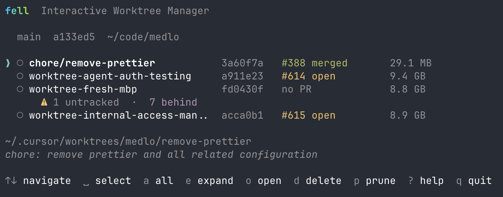

```
▗▞▀▀▘▗▞▀▚▖█ █ 
▐▌   ▐▛▀▀▘█ █ 
▐▛▀▘ ▝▚▄▄▖█ █ 
▐▌        █ █                         
```

> *"To fell a tree."* 

`fell` is a CLI tool that help's you actively manage, prune and delete worktrees.

## Why?

Git worktrees accumulate. Agent tools (Cursor, Claude Code) create them freely. After a few weeks you have a dozen stale worktrees, some with merged PRs, some with unpushed changes, and `git worktree list` gives you a wall of paths with no context.

`fell` shows you what each worktree actually is -- its PR status, whether it has uncommitted work, and how far behind it is -- so you can clean up confidently.


## Install

```bash
bun add -g @doccy/fell
```

Requires [Bun](https://bun.sh) and git. [GitHub CLI](https://cli.github.com) (`gh`) is optional -- enables PR status display.

## Usage

```bash
fell              # interactive TUI
fell --list       # print worktrees + PR statuses and exit
fell --help       # show help
```

### Interactive commands

```
up/down or k/j   Navigate worktree list
space             Toggle selection
a                 Select / deselect all
e                 Expand / collapse file list
o                 Open worktree in file manager
d                 Delete worktree(s) + optionally branches
p                 Prune stale references
r                 Refresh list + PR statuses
?                 Help (prune vs delete explained)
q / ctrl+c        Quit
```

### What you see

- Branch name, short SHA, and PR status for each worktree
- File status sub-lines (staged, modified, untracked, unpushed, behind) with warning indicators
- Focused item shows full path and PR title
- PR numbers are clickable links in supported terminals (iTerm2, Kitty, WezTerm)


### Prune vs delete

**prune** cleans up stale administrative references -- when a worktree directory has been manually deleted (`rm -rf`) but git still tracks it. Equivalent to `git worktree prune`. Safe: only affects already-missing worktrees.

**delete** properly removes a worktree from disk and cleans up git tracking. Optionally also deletes the branch. Equivalent to `git worktree remove`. Destructive.

### Preview



## License

MIT
